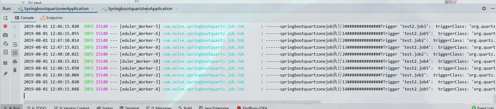

# Getting Started

* 本实例为spring-boot-starter-quartz集群实践，用mysql存储了脚本数据
* [常用数据库脚本](./dbTables),quartz版本为2.2.3,可以选择对应的sql脚本执行，用作存储定时任务数据
* 示例中为了初始化任务，使用了CommandLineRunner初始化了5个任务，可以直接运行两个任务，观察定时任务效果。也可以杀掉其中某个服务，观察任务执行情况

---

[详细的过程可以参考我写的这篇文章](https://eelve.com/archives/springbootstarterquartzs)

[同时也欢迎大家访问我的个人博客](https://eelve.com)

# License
Released under the [MIT](LICENSE) License.
